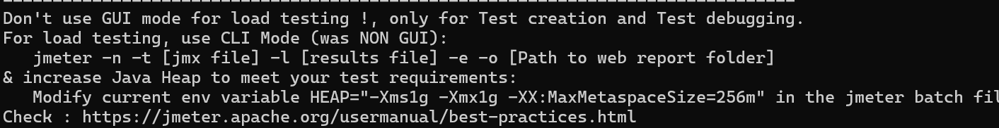

## JMeter load test for `/work`
As the JMETER recommended way to load test Java applications

### 1. Test plan idea

Create a simple JMeter test plan:

- **Thread Group**:
  - Threads (users): 50–200
  - Ramp-up period: 10–30 seconds
  - Loop count: forever (or a large number)
- **HTTP Request**:
  - Method: GET
  - Path: `/work`
  - Parameters: `n=20000`
  - Server name or IP: `localhost`
  - Port: `8080`
- **Listeners**:
  - Summary Report
  - Aggregate Report

### 2. Running the test

1. Start the Spring Boot app locally.
2. Open JMeter GUI, configure the plan as above (or use a `.jmx` file if you create one).
3. Start the test and watch:
   - Response times (P90, P95, P99).
   - Throughput.
   - Error percentage.

#### Running the same plan from the command line

`work-load.jmx` is a plan test that was configured and saved with JMeter GUI.
If you prefer headless execution (better for automation/CI), save the plan as `work-load.jmx` and run:

```bash
# Run JMeter non-GUI, write raw results, and create HTML report
# Result.jtl is overwritten each time
jmeter -n -t work-load.jmx -l result.jtl -e -o report
```

- The `-J` flags map to JMeter user-defined variables; reference them in the plan as `${serverHost}`, `${serverPort}`, `${n}`.
- `results/work-load.jtl` stores the raw sample data; `results/report/` will contain the generated HTML dashboard.
- To run multiple iterations with different loads, override variables: `jmeter -n -t work-load.jmx -Jthreads=100 -Jramp=20 ...`.
- After the run, open `results/report/index.html` in a browser to review metrics without the GUI.

### 3. Combining with profiling and metrics

- While JMeter is running, capture a CPU profile with Async Profiler.
- If running via Docker stack, observe Prometheus / Grafana dashboards at the same time.
